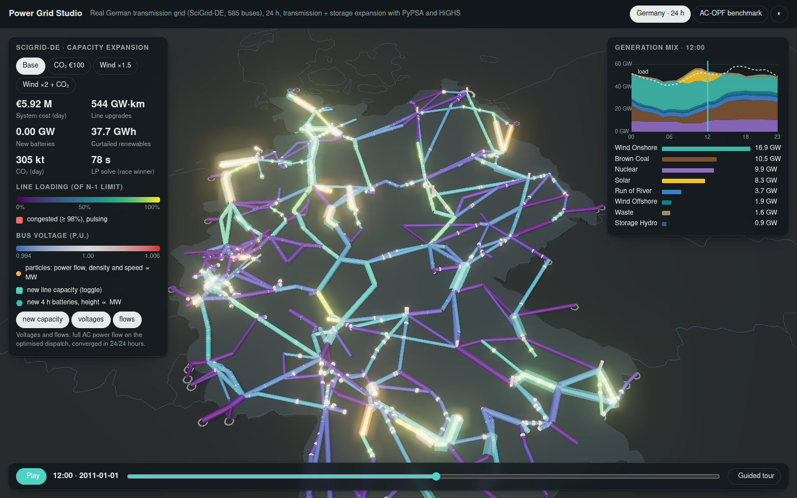
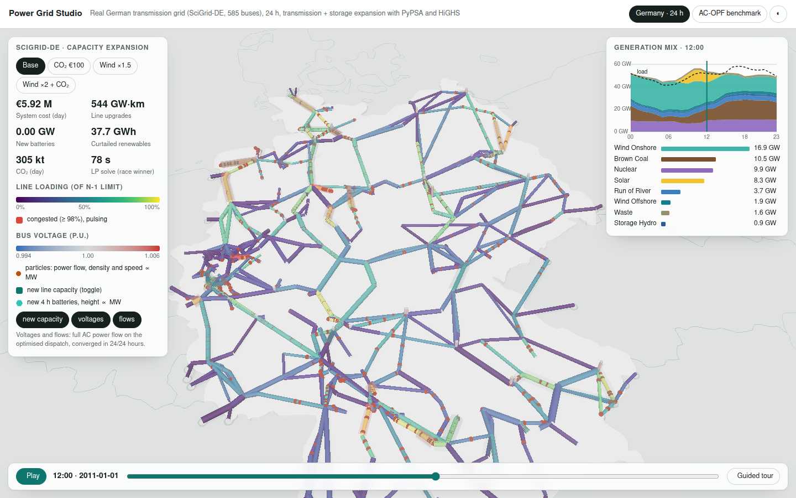
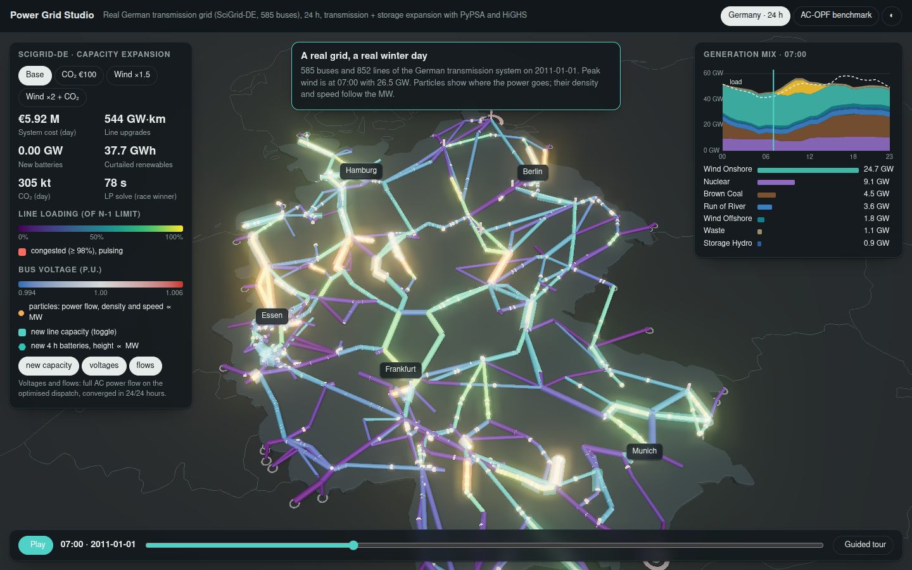
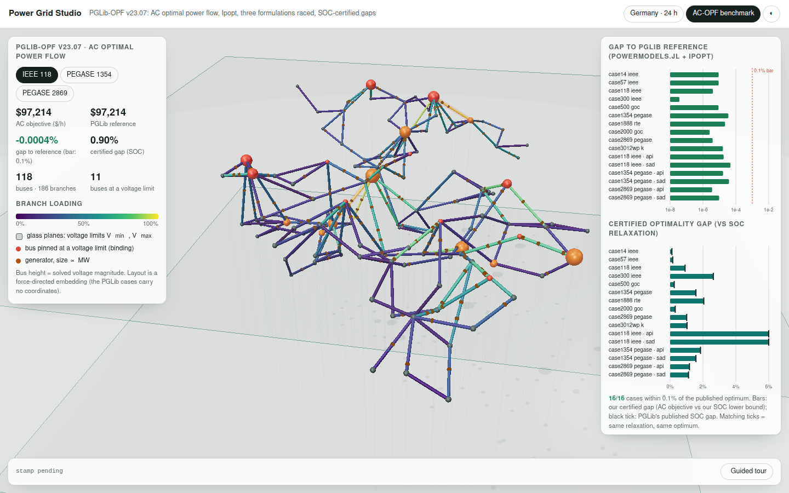
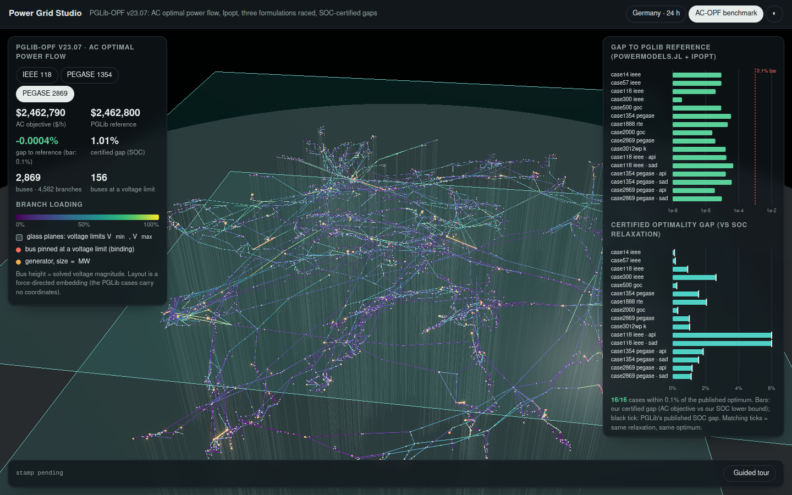

# Power grids: AC optimal power flow and capacity expansion

Open-source power-system optimisation, run by agents on qBraid compute, checked
against the community benchmark, and shown in a three.js "Power Grid Studio".

| | Open-source stack | Stands in for |
|---|---|---|
| AC optimal power flow | Egret (Pyomo) + Ipopt 3.14, pandapower | PSS/E OPF, PowerWorld OPF |
| Dispatch and capacity expansion | PyPSA + HiGHS | PLEXOS (LP planning core) |



## What top-10% means here, and the verdict

**AC-OPF.** The community benchmark is [PGLib-OPF](https://github.com/power-grid-lib/pglib-opf) (IEEE PES
task force). Its `BASELINE.md` publishes the best-known AC objective for every case, from
PowerModels.jl + Ipopt, the de-facto research reference, together with the SOC and QC
relaxation gaps. Most published new methods (including ML-based OPF) report optimality gaps
in the 0.1–1% range. Our bar:

1. Match the published AC objective **within 0.1%** on every case attempted, including PGLib's
   stress variants (API: active-power increase; SAD: small angle difference).
2. **Certify** each answer ourselves. A local NLP solver only finds a local optimum, so
   we also solve the convex SOC relaxation, which gives a lower bound, and report the certified gap.
   It should reproduce PGLib's published SOC gap.

**Verdict: reached.** 16/16 cases are within 0.1% of the published optimum (the differences are at the 5-significant-figure rounding of BASELINE.md), and every certified gap reproduces PGLib's published SOC gap.

| Case | Buses | Ours ($/h) | PGLib ref | Gap to ref | Certified gap (ours / PGLib SOC) | Fastest formulation |
|---|---|---|---|---|---|---|
| case14_ieee | 14 | 2,178.08 | 2.1781e+03 | -9.0e-06 ✅ | 0.11% / 0.11% | rectangular 0.1 s |
| case57_ieee | 57 | 37,589.34 | 3.7589e+04 | +9.0e-06 ✅ | 0.16% / 0.16% | rectangular 0.1 s |
| case118_ieee | 118 | 97,213.61 | 9.7214e+04 | -4.0e-06 ✅ | 0.90% / 0.91% | rectangular 0.3 s |
| case300_ieee | 300 | 565,219.98 | 5.6522e+05 | -3.7e-08 ✅ | 2.62% / 2.63% | rectangular 0.5 s |
| case500_goc | 500 | 454,945.98 | 4.5495e+05 | -8.8e-06 ✅ | 0.24% / 0.25% | current-voltage 1.4 s |
| case1354_pegase | 1,354 | 1,258,843.99 | 1.2588e+06 | +3.5e-05 ✅ | 1.57% / 1.57% | rectangular 4.1 s |
| case1888_rte | 1,888 | 1,402,530.87 | 1.4025e+06 | +2.2e-05 ✅ | 2.04% / 2.05% | current-voltage 29.1 s |
| case2000_goc | 2,000 | 973,432.47 | 9.7343e+05 | +2.5e-06 ✅ | 0.31% / 0.31% | current-voltage 9.0 s |
| case2869_pegase | 2,869 | 2,462,790.43 | 2.4628e+06 | -3.9e-06 ✅ | 1.01% / 1.01% | current-voltage 17.5 s |
| case3012wp_k | 3,012 | 2,600,842.72 | 2.6008e+06 | +1.6e-05 ✅ | 1.02% / 1.03% | rectangular 8.9 s |
| case118_ieee__api | 118 | 249,614.52 | 2.4961e+05 | +1.8e-05 ✅ | 26.16% / 26.17% | polar 0.3 s |
| case118_ieee__sad | 118 | 105,155.05 | 1.0516e+05 | -4.7e-05 ✅ | 8.20% / 8.17% | rectangular 0.2 s |
| case1354_pegase__api | 1,354 | 1,608,226.87 | 1.6082e+06 | +1.7e-05 ✅ | 1.85% / 1.85% | rectangular 3.5 s |
| case1354_pegase__sad | 1,354 | 1,258,848.04 | 1.2588e+06 | +3.8e-05 ✅ | 1.56% / 1.57% | rectangular 3.5 s |
| case2869_pegase__api | 2,869 | 3,062,988.91 | 3.0630e+06 | -3.6e-06 ✅ | 1.18% / 1.18% | rectangular 11.1 s |
| case2869_pegase__sad | 2,869 | 2,468,676.30 | 2.4687e+06 | -9.6e-06 ✅ | 1.12% / 1.12% | polar 10.9 s |

**Capacity expansion.** No public leaderboard exists for planning models. The bar we
can defend is method parity:
- Reproduce PyPSA's documented SciGrid-DE study (the real German grid) end to end.
- Add co-optimised line and storage expansion.
- Race the LP solvers.
- Validate the dispatch with a full AC power flow every hour.

**Verdict: method parity reached.** The documented SciGrid-DE study is reproduced and extended with co-optimised line and battery expansion, the LP solvers are raced, and every scenario's dispatch is re-checked with a full AC power flow (see `converged` in the viewer data). This is not a head-to-head with PLEXOS; no public benchmark exists for that.

| Scenario | System cost (day) | Line upgrades | Lines upgraded | New batteries | Curtailed | CO₂ | LP race (winner, s) |
|---|---|---|---|---|---|---|---|
| w1.0_s1.0_c0 | €5.92 M | 544 GW·km | 64 | 0.00 GW | 37.7 GWh | 305 kt | simplex stopped 80, ipm won 78 |
| w1.0_s1.0_c100 | €17.97 M | 2233 GW·km | 135 | 0.55 GW | 13.7 GWh | 44 kt | simplex stopped 92, ipm won 90 |
| w1.5_s1.0_c0 | €4.78 M | 530 GW·km | 67 | 0.00 GW | 189.5 GWh | 212 kt | simplex stopped 60, ipm won 58 |
| w2.0_s1.0_c100 | €6.12 M | 2321 GW·km | 142 | 0.03 GW | 301.2 GWh | 2 kt | simplex stopped 126, ipm won 124 |

Reading the race: the losing solver is stopped as soon as the winner finishes. For scale,
HiGHS dual simplex **on its own** took 766 s on the base scenario (measured before the race was added), so
racing it against IPM cut time-to-answer about 10×. The carbon price is what makes the network expand:
at €100/t the optimiser builds about 4× more line capacity, and CO₂ falls from 305 to 44 kt/day.
With doubled wind, curtailment rises to 301 GWh/day even after 2,321 GW·km of upgrades. That's the
classic "wind north, load south" bottleneck, visible as pulsing lines in the viewer.

## The viewer

`viewer.html` is self-contained: the data is inlined, and three.js 0.170 loads from jsDelivr.

- **Germany · 24 h.** The 585-bus SciGrid-DE network on a map:
  - **Flow particles** on every line; density and speed follow the MW, direction follows the flow.
  - **Line colour:** loading against the N-1 limit (viridis). Congested lines (≥ 98%) pulse.
  - **Bus voltages** from the AC power flow, as pillars and halos.
  - **New line capacity and batteries** chosen by the optimiser.
  - A **24-hour scrubber** with an animated stacked generation mix, a **scenario switcher** with deltas against the base, and a data-driven **guided tour**.
- **AC-OPF benchmark.** The IEEE 118, PEGASE 1354 and PEGASE 2869 networks in 3D:
  - **Bus height** is the solved voltage, between glass planes at the legal limits.
  - **Buses pinned at a limit** glow red: these are the binding constraints that set prices.
  - **Panels:** the gap to PGLib, the certified gap against PGLib's SOC gap, and the formulation race.

URL hash options: `#dark`, `#light`, `#opf`, `#tour`, combinable (`viewer.html#opf-dark`).

| | |
|---|---|
|  |  |
|  |  |

## Reproduce

```bash
# on a qBraid instance (here: the shared gpu-l4 instance, ~5 cgroup CPUs)
export MAMBA_ROOT_PREFIX=/tmp/mamba ENV=/tmp/energy-grid/env
micromamba create -y -p $ENV -c conda-forge python=3.12 ipopt=3.14 pyomo pypsa highspy networkx scipy pandas numpy netcdf4
$ENV/bin/pip install gridx-egret "pandapower>=3"
export PATH=$ENV/bin:$PATH OMP_NUM_THREADS=1
git clone --depth 1 https://github.com/power-grid-lib/pglib-opf.git

# AC-OPF: race 3 formulations, compare with BASELINE.md, certify with SOC
python opf/acopf_pglib.py pglib-opf out case118_ieee case1354_pegase case2869_pegase case118_ieee__api ...

# Expansion: SciGrid-DE (python -c "import pypsa; pypsa.examples.scigrid_de().export_to_netcdf('scigrid_de.nc')")
python expansion/expansion.py scigrid_de.nc exp w1.0_s1.0_c0 --pf      # wind x1, solar x1, CO2 0 EUR/t

# Viewer (on the pod; networkx for layouts)
python build_viewer.py
```

`run_all.sh` chains these steps.

## Honest limits

- **Not a PSS/E replacement for dynamics.** Transient and small-signal stability, protection
  coordination and vendor-certified device models are out of scope for these tools.
- **The PLEXOS comparison is about the optimisation core, not the product.** PLEXOS's integrated market data,
  stochastic unit commitment and support are not reproduced here.
- **Expansion uses a linear (DC) network with fixed impedances,** like every LP planning model. We check the
  dispatch with a full AC power flow afterwards. Line upgrades are treated as capacity only.
- **One representative day (2011-01-01) and annualised costs scaled to 24 h.** This is a method demonstration,
  not an investment recommendation. Storage in particular needs multi-day periods to be valued fairly.
- **The voltage set points in SciGrid-DE are unknown.** Generators are voltage-controlled at 1.0 p.u. (PyPSA's recipe),
  so the bus voltages show the network's response, not measured values.
- **Timings are on a shared box with about 5 CPUs and Ipopt with MUMPS.** PGLib's reference timings use HSL MA27, which is 2–6× faster.

## Quantum, honestly

- **Today:** unit commitment and expansion fit QUBO/QAOA only at toy size. The LP and NLP stack above wins by
  orders of magnitude and gives certificates (SOC gaps) that no sampler does.
- **Later:** this is optimisation, so the outlook is as in `skills/optimization-stack`: Grover-type speedups need fault
  tolerance and are largely eaten by overheads at practical sizes.

## Verification stamp

```
energy-grid · verified 2026-10-01 (UTC)
machine: qBraid gpu-l4 instance (shared; cgroup ~5 CPUs, 62 GB), CPU only, 1 thread per solve
env: conda-forge python 3.12, ipopt 3.14.20 (MUMPS), pyomo 6.10.1, gridx-egret, pypsa 1.2.4, highspy, pandapower 3.5.5, numpy 2.4.6
AC-OPF: PGLib-OPF v23.07 (commit dc6be4b), 16 cases (TYP 10, API 3, SAD 3), 3 formulations raced + SOC relaxation each: ~25 min wall in total
expansion: PyPSA SciGrid-DE (2011-01-01, 24 h), 4 scenarios, HiGHS simplex vs IPM raced: 58-124 s per scenario (IPM won all 4)
cost: ~0.8 slot-hours on the shared instance (≈ $0.20 of its $0.49/h); $0 on the subscription pod
```
