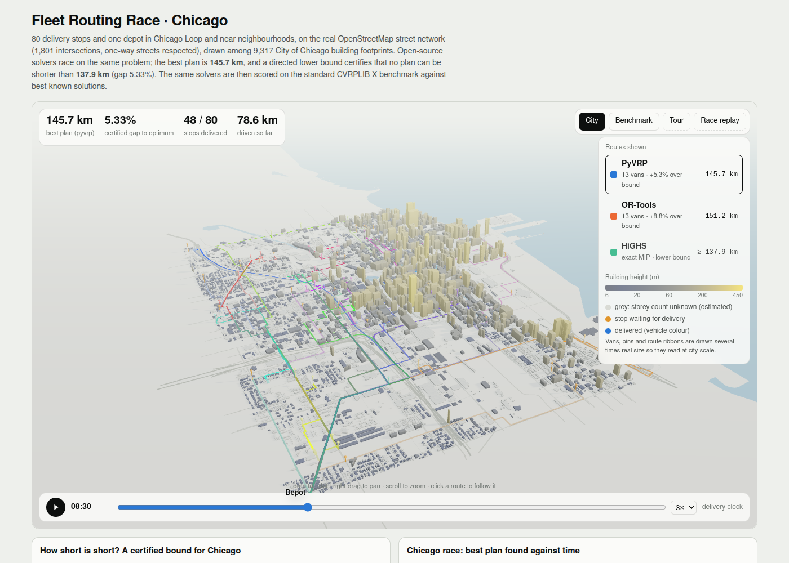
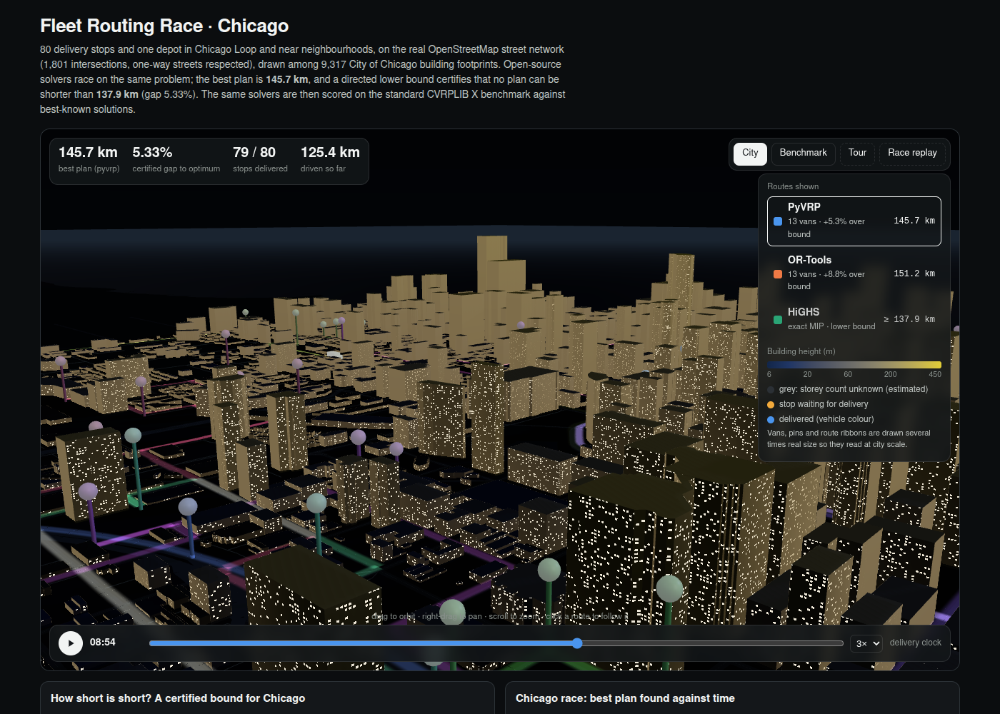
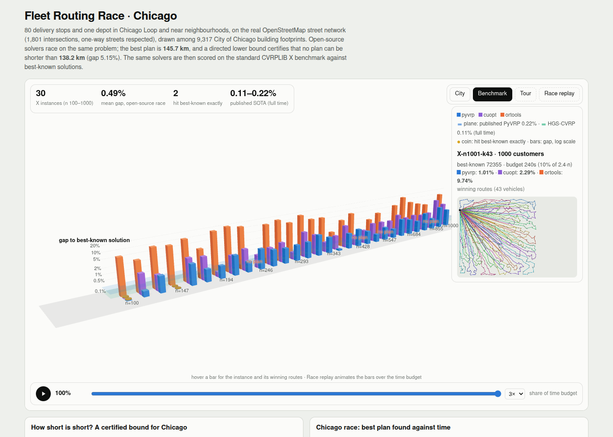

# Fleet routing: open-source solvers, raced, certified and benchmarked

Deliver to 80 stops on the real Chicago street network with a capacity-limited
fleet, using open-source solvers **raced** against each other. The race's answer is
**certified** with a lower bound, and the same solvers are **scored on the
standard CVRPLIB X benchmark** against best-known solutions. The result is a
three.js city of 9,317 real buildings, with vans driving their routes on a
delivery clock, plus a 3D benchmark arena.

It stands in for commercial routing and MIP stacks (Gurobi, CPLEX and routing
products built on them), and it measures where quantum optimisation stands today.



## What "top-10%" means here, and where this lands

**The benchmark.** The CVRPLIB X set (Uchoa et al. 2017) is the field's standard:
100 instances, 100 to 1,000 customers, scored by the gap to the best-known solution
(BKS). The published protocol gives each instance Tmax = 2.4·n seconds. At that budget
the published state of the art is:
- **HGS-CVRP: 0.11%** mean gap (Vidal 2022);
- **PyVRP: 0.22%** (Wouda, Lan & Kool 2024, mean of 10 seeds).

Generic routing libraries typically sit several percent away. So top-10% for an
open stack means: **within the published PyVRP gap at the published budget**.

| Verdict | Measured |
|---|---|
| **CLOSE** | At the **full published budget** (2.4·n s, one pinned core per instance) on 30 stratified X instances, one seed: PyVRP averages **0.34%**, and the race with the GPU solver **0.31%**, against the 0.22% bar. That is about 1.4x the published PyVRP gap and 2.8x HGS-CVRP. Instances under 300 customers beat the bar (0.14%); 600–1000 customers do not (0.69%). |

## Results

Verification stamp, **2026-10-01**:
- CPU solvers ran one thread each with the same per-solver budget: 21 instances on the qBraid subscription pod, and the 9 largest on the shared qBraid gpu-l4 instance after a pod restart.
- The full-budget check and the 900 s Chicago bound ran on the shared instance.
- cuOpt ran on the shared qBraid gpu-l4 instance.
- Envs: `requirements.txt` and `requirements-gpu.txt`.
- The full-budget run used a dedicated 32-vCPU box shared by three streams (cores 20–29 here).
- Total compute charged to this example: ~0 credits directly (the boxes are owned by the coordinator).

### 1. CVRPLIB X benchmark at the full published budget (verified 2026-10-01)

**Setup:**
- 30 of the 100 X instances, stratified by size (`data/X/xsub.txt`).
- PyVRP 0.14, single-thread, **Tmax = 2.4·n s**, one seed.
- One pinned core per instance, 10 in parallel on a dedicated 32-vCPU qBraid CPU box (cores 20–29).
- Wall time 54 min; 8.3 CPU-hours.
- The cuOpt column is the earlier L4 run, which had only **10%** of this time. Racing it in is conservative.

| Size group | Instances | **Race (PyVRP full + cuOpt)** | PyVRP, full time | PyVRP, 10% time |
|---|---|---|---|---|
| n 100–299 | 13 | **0.14%** | 0.15% | 0.47% |
| n 300–599 | 10 | **0.27%** | 0.30% | 0.54% |
| n 600–1000 | 7 | **0.69%** | 0.74% | 0.92% |
| **all** | 30 | **0.31%** | 0.34% | 0.60% |

- 4 instances hit best-known exactly, and 25 of 30 are within 0.5%.
- cuOpt still beats full-time PyVRP on 5 instances despite 10x less time.

**Verdict: CLOSE, not reached.** The mean is 0.31% against the published 0.22% (PyVRP) and 0.11% (HGS-CVRP).

**How fair the comparison is:**
- **Same budget and metric.** The time budget and the metric (mean gap to best-known) match the published protocol.
- **Fewer instances and seeds.** It uses a 30-instance stratified subset instead of all 100, and one seed instead of the mean of 10.
- **Expected value, noisier.** One seed has the same expected value but more noise, mostly on the large instances.
- **Untested CPU speed.** The published budget is defined on a reference CPU (PassMark single-thread 2183). This box's speed relative to it wasn't measured, so the effective budget may differ in either direction.
- **Where the gap is.** The shortfall sits in the 600–1000-customer instances. That is where the published HGS-CVRP still leads PyVRP, and where 10 seeds would help most.

**What would close it** (all on the same box, about 4 h wall at 10 cores each):
- all 100 instances at 3 seeds;
- a matching full-budget cuOpt run on the L4, about $2.

### 1b. CVRPLIB X benchmark at 10% of the published budget (earlier run, 30 of 100 instances, stratified by size)

The subset is every ~3rd instance by size (`data/X/xsub.txt`). Each solver gets
**10% of the published budget** (0.24·n s), because the shared box allows about
5 CPUs across ten projects. That handicaps every solver equally.

| Size group | Instances | **Race (best of all)** | PyVRP | cuOpt (L4) | OR-Tools |
|---|---|---|---|---|---|
| n 100-299 | 13 | **0.35%** | 0.47% | 0.63% | 9.74% (1 no plan) |
| n 300-599 | 10 | **0.42%** | 0.54% | 0.91% | 5.56% (2 no plan) |
| n 600-1000 | 7 | **0.87%** | 0.92% | 1.78% | 7.61% (1 no plan) |
| **all** | 30 | **0.49%** | 0.60% | 0.99% | 7.96% (4 no plan) |

2 instances hit the best-known solution exactly; 18 of 30 are within 0.5%. cuOpt beats PyVRP on 10 of 30 instances (mostly n < 500), which is why racing the GPU solver is worth it: race 0.49% vs PyVRP alone 0.60%.

**Full published budget, 6 smallest instances (PyVRP):** mean gap **0.05%** vs 0.31% at 10% budget on the same instances (X-n101 to X-n181, one seed). Small instances are the easiest, so this is evidence that the 10% budget explains the gap, not a claim about the whole set.

Read it this way:
- **PyVRP:** at a tenth of the time it is already within about half a percent of
  the best solutions ever found, which is the state of the art for open code.
- **OR-Tools routing:** the most-used open routing library, but several percent
  behind on this set.
- **cuOpt:** see the next section.

Racing them costs nothing extra and guarantees the best of all three.

**cuOpt note.** cuOpt minimises **fleet size first**, then distance; that is its
documented objective. CVRPLIB scores distance only. The objective setting used here
(minimum fleet = k_min + 1; on X-n101 the default gave 31,271 (+13%), an explicit zero fleet cost 27,653, and k_min + 1 the best-known 27,591; `results/cuopt_objective_choice.json`) was chosen on X-n101 alone, with no best-known information, from:
- the default;
- an explicit zero fleet cost;
- one vehicle above the minimum.

So cuOpt's numbers reflect a mismatch of objectives, not just search quality. For
fleet-cost problems its default is the right one.

### 2. Chicago, 80 stops, real one-way streets: certified

| | v1 | v2 |
|---|---|---|
| Best plan (PyVRP, 60 s race) | 145.7 km | 145.7 km |
| Lower bound | 133.4 km (symmetric relaxation) | **138.2 km (directed ACVRP)** |
| Certified gap | 8.44% | **5.15%** |

Version 1 bounded the problem with `min(d_ij, d_ji)` on every street. That is a
valid relaxation, but it throws away the one-way information: 20% of the arcs are
more than 5% longer in one direction. Version 2 (`bound.py`) solves the **directed
two-index ACVRP** on HiGHS with rounded capacity cuts `x(δ⁺(S)) ≥ ⌈d(S)/Q⌉`. The cuts
come from three separators:
- connected components at several thresholds;
- greedy set growth;
- **exact fractional-capacity separation**: one max-flow per customer seed,
  Harche–Rinaldi style.

That gives 2,804 cuts, then a MIP phase seeded with PyVRP's routes (900 s, 2 threads on the shared instance; a 300 s single-thread run gives 137.9 km / 5.33%). Capacity is
95% utilised (1,240 units of demand on 13 vehicles of 100), which keeps
bin-packing tight.

**What closes the rest:** branch-cut-and-price with route-based columns (the
VRPSolver family). No open-source package offers it ready-made today. The plan is
probably within 1–2% of optimal, but only the gap above is *certified*.

### 3. Known-answer anchors (unchanged from v1)

| Instance | Known | Found | Lower bound | Status |
|---|---|---|---|---|
| E-n22-k4 | 375 (opt) | 375 | 375 | **proven optimal** |
| A-n32-k5 | 784 (opt) | 784 | 784 | **proven optimal** |
| X-n101-k25 | 27591 (BKS) | 27591 | 26034 | certified gap 5.6% |

### 4. Quantum readiness: QAOA on one route (unchanged from v1)

| Setup | Value |
|---|---|
| Problem | 16 qubits, one 4-stop route |
| Depths | p = 1–3 |
| Shots | 1000 per depth |
| P(optimal tour) | 0.11–0.14% |

That is 70–90x better than a random bitstring, but 30–40x worse than simply picking
a random valid tour, because 97% of shots break the one-hot constraints. Brute force
takes 0.1 ms. The pipeline (encoding, angle transfer to Qiskit, shot-based scoring)
is verified and ready for a QPU. It is a readiness experiment, not an advantage.

## The viewer

`viewer.html` is self-contained: the data is inlined, three.js 0.170 comes from the
jsDelivr CDN, and it weighs about 1.5 MB. Open it in a browser, or run
`qbraid-canvas viewer.html`.

- **City.** 9,317 City of Chicago building footprints, extruded by storey count and
  tinted by height (cividis, with a colour bar). Grey means the storey count is
  unknown. Around them:
  - classed OSM roads, with the river and the Lake Michigan shoreline;
  - shadows, plus a sun that follows the delivery clock;
  - night mode (dark theme) with procedural window lights.
- **Vans and trails.**
  - Instanced vans drive their real street paths on a time-of-day scrubber, at
    08:00 + 22 km/h with 4 min per stop.
  - Each route is a shader ribbon: a glowing trail behind the van, a faint path ahead.
  - Stops turn from amber to the van's colour on delivery.
  - Click a route to follow its van.
- **Race replay.** The 60-second race plays on a log clock, with a live
  leaderboard (bars on a shared km axis against the certified bound). The map
  switches to whichever solver leads.
- **Benchmark arena.** 3D bars of the gap to best-known per instance and solver,
  on a log scale (0–20%):
  - translucent planes mark the published PyVRP and HGS-CVRP levels;
  - gold coins mark exact best-known hits;
  - hover shows a mini-map of the winning routes;
  - Race replay shrinks the bars over the time budget.
- **Guided tour.** Five annotated camera stops, ending in the arena.

The scales are exaggerated so things stay readable at city scale (vans ~8x,
pins ~4x, route ribbons 24 m). The page says so.

URL hash options:
- `#theme=dark|light`
- `#mode=bench`
- `#t=8.5` (clock, in hours)
- `#cam=x,y,z,tx,ty,tz`
- `#race=5` (seconds into the race)
- `#notour`
- `#shot` (static, for screenshots)
- `#debug`

| | |
|---|---|
|  |  |

## Reproduce

```bash
python3.12 -m venv .venv && . .venv/bin/activate
pip install -r requirements.txt
./run_all.sh                         # anchors, Chicago race, QAOA (~10 min on 4 vCPU)
python bound.py --time 300           # directed Chicago bound
python scenery.py                    # buildings (City of Chicago portal) + OSM roads/water
python bench.py --list data/X/xsub.txt --dir data/X --factor 0.1 --sequential --out results/xbench
# GPU racer (separate venv, CUDA 12):
pip install --extra-index-url https://pypi.nvidia.com -r requirements-gpu.txt
python cuopt_bench.py --list data/X/xsub.txt --dir data/X --factor 0.1 --out results/xbench_cuopt
python summarize.py && python build_viewer.py
```

**Data gotchas:**
- `overpass-api.de` answers HTTP 406 to cloud IPs. `scenery.py` uses the
  `maps.mail.ru` Overpass mirror (`OVERPASS_URL` overrides it).
- Building heights come from the City of Chicago "Building Footprints" dataset
  (`syp8-uezg`), which has official footprints with a `stories` field.
- Lake Michigan is OSM relation 1205149, not coastline ways.

## Honest positioning

- **Routing.** The open race is close to the published state of the art for CVRP:
  0.49% at a tenth of the time, against 0.11–0.22% at full time. It is not
  "Gurobi-class MIP"; it is better than a general MIP at routing.
- **General MIP.** Not Gurobi-class. On Mittelmann MIPLIB2017 (Apr 2026) HiGHS is
  7.4x slower than the fastest commercial solver and solves 68% vs 91%.
- **Certification.** Open tools prove optimality to about 30 customers and give
  5–6% certified gaps at 80–100. Commercial MIP alone doesn't close those either;
  branch-cut-and-price does.
- **Quantum.** A readiness experiment on a 16-qubit sub-problem.

## Next (costed)

| Step | Where | Estimate |
|---|---|---|
| All 100 X instances at the full published budget, 3 seeds, PyVRP | `cpu-32v-128g`, 30 cores | ~75 CPU-h → ~2.5 h wall, **~$5** |
| cuOpt at the full budget on all 100 | `gpu-l4` | ~30 h GPU → **~$15**; or `gpu-h100-sxm` for larger instances |
| QAOA on IQM Garnet, p = 1–3, 1000 shots each | QPU | **525 credits ($5.25)**. Ask first; expect mostly noise |

## Files

| File | Role |
|---|---|
| `vrp/instance.py`, `vrp/solvers.py` | instances, checking, the three CPU solvers |
| `race.py` | racing harness and certify step |
| `bench.py` | X benchmark harness (checkpointed, race or sequential) |
| `cuopt_bench.py` | cuOpt GPU racer (objective modes) |
| `summarize.py` | benchmark summary and verdict |
| `city.py` | OSM scenario and street geometry |
| `bound.py` | directed ACVRP lower bound (exact min-cut separation) |
| `scenery.py` | buildings, classed roads, water, shoreline |
| `qaoa_tsp.py` | TSP QUBO, QAOA simulator, Qiskit cross-check |
| `build_viewer.py`, `viewer_template.html` | build `viewer.html` |
| `data/X/` | the 30 X instances and BKS (CVRPLIB via PyVRP/Instances) |
| `results/` | all JSON results and screenshots |

**Sources:**
- Uchoa et al. (2017), *EJOR* 257(3).
- Vidal (2022), *Computers & OR* 140.
- Wouda, Lan & Kool (2024), *INFORMS JoC*.
- City of Chicago data portal.
- OpenStreetMap contributors (ODbL).
