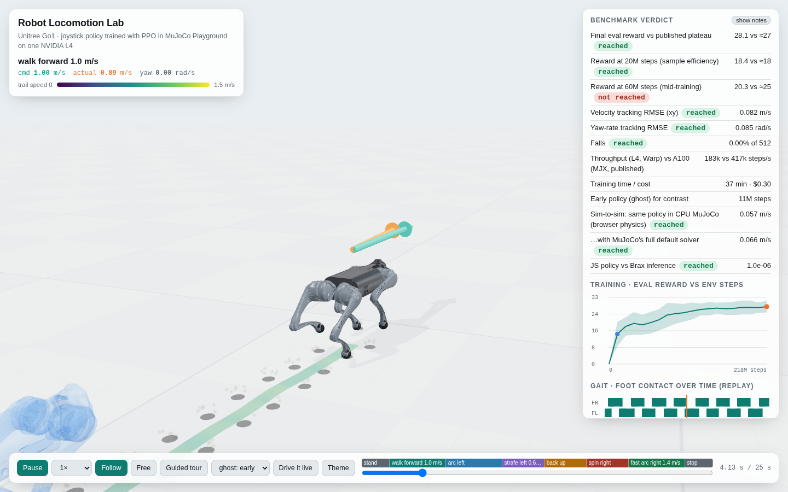

# Robot locomotion: a Go1 joystick policy trained on one L4, driven live in the browser

This example trains a Unitree Go1 quadruped to follow joystick commands (forward and sideways velocity, plus turn rate) with PPO in [MuJoCo Playground](https://github.com/google-deepmind/mujoco_playground) (Apache-2.0). It uses the official Playground recipe on a single qBraid `gpu-l4`. The trained policy is benchmarked against the published Playground results, then shipped two ways in one self-contained page:

- **Replay.** Recorded rollouts are shown in three.js: the real Go1 meshes with PBR, soft shadows, footprints, a gait diagram, commanded-versus-achieved velocity arrows, an early-policy ghost, an in-scene training curve and a guided tour.
- **Live.** Press **Drive it live**. MuJoCo 3.14 (the official WebAssembly build) simulates the same Go1 model in your browser. The trained network, re-implemented in about 60 lines of JS, controls it from your keyboard (`W A S D Q E`). **Kick it** shoves the robot so you can watch it recover.

Open `viewer.html` (it needs network access for three.js and MuJoCo WASM from jsDelivr), or run `qbraid-canvas robotics/viewer.html`.



## Commercial stand-ins
MATLAB Simulink + Simscape Multibody, MSC Adams, and NVIDIA Isaac Sim/Lab (free, not open source). Here everything is OSI-licensed: MuJoCo, MuJoCo Playground, Brax and three.js are Apache-2.0 or MIT, and the Go1 model comes from MuJoCo Menagerie (BSD-3).

## What "top 10%" means here, and the result
Legged-robot RL has no single leaderboard. The strongest public reference for this exact task is the **MuJoCo Playground technical report** (2025), which trained the same environment with the same PPO recipe and deployed the policy on a real Go1. We compare against it directly and add physical task metrics that the reward alone hides.

<!--BENCH-->
| Check | Result | Verdict | Notes |
|---|---|---|---|
| Final eval reward vs published plateau | 28.1 vs ≈27 | **reached** | at 218M steps; reference = Playground report Fig. 11 (5 seeds, band ≈26–28, read off the figure ±1) |
| Reward at 20M steps (sample efficiency) | 18.4 vs ≈18 | **reached** | nearest eval at 22.9M |
| Reward at 60M steps (mid-training) | 20.3 vs ≈25 | **not reached** | nearest eval at 57.3M. We lag the reference by ~20M steps here, then catch up (26.7 at 126M). Likely causes: one seed vs a 5-seed mean, and the job-cap resume at 45.9M restarted Adam's moment estimates |
| Velocity tracking RMSE (xy) | 0.082 m/s | **reached** | 512 episodes × 20 s, env's own random commands up to 1.5 m/s, 1 s settling excluded; bar ≤0.15 m/s is ours (no published RMSE) |
| Yaw-rate tracking RMSE | 0.085 rad/s | **reached** | commands up to 1.2 rad/s |
| Falls | 0.00% of 512 | **reached** | torso up-vector below horizontal at any point in 20 s |
| Throughput (L4, Warp) vs A100 (MJX, published) | 183k vs 417k steps/s | — | different GPU and backend: A100 has ~5× the memory bandwidth of the L4. On qBraid that is $0.14 per 100M steps on gpu-l4 |
| Training time / cost | 37 min · $0.30 | — | 218M steps on one gpu-l4 ($0.49/h), two capped jobs; all GPU use incl. evals and a failed start: 42 min, $0.34 |
| Early policy (ghost) for contrast | 11M steps | — | tracking RMSE 0.93 m/s, falls 0.2% |
| Sim-to-sim: same policy in CPU MuJoCo (browser physics) | 0.057 m/s | **reached** | scripted 25 s joystick course, no fall; trained on MuJoCo Warp |
| …with MuJoCo's full default solver | 0.066 m/s | **reached** | iterations=100, ls_iterations=50 (training used 1 / 5): the policy does not exploit the coarse solver |
| JS policy vs Brax inference | 1.0e-06 | **reached** | max |action diff|; the browser runs this exact network |
<!--/BENCH-->

**How the references were read.**
- The final-reward reference is read off Fig. 11 of the report (Go1JoystickFlatTerrain, Brax PPO, 5 seeds, A100). The curve plateaus around 27 by 100–200M steps, and we treat the 5-seed band as roughly 26–28 (±1 for reading a plot).
- Throughput is Table 7 (417,451 ± 2,955 PPO steps/s on an A100 with the MJX backend).
- The report gives no tracking-error or fall-rate numbers. The ≤ 0.15 m/s and ≤ 0.2 rad/s bars are our own, chosen as about 10% of the commanded range.

## Method
- **Task and recipe:** `Go1JoystickFlatTerrain`, with Playground's default environment config, `brax_ppo_config` and domain randomisation. That's 8,192 parallel environments, a 512-256-128 MLP with swish activations, a privileged critic and 200M environment steps. The physics backend is Playground 0.2.0's default, MuJoCo Warp. The report used MJX (JAX), but both share the same model and solver settings (`iterations=1`, `ls_iterations=5`).
- **Capped GPU jobs:** the shared pool caps GPU jobs at 40 minutes. `train.py` saves `params_<step>.pkl` at every evaluation, and `run_resume.sh` restarts from the latest one with the step counter offset. The observation normaliser is restored with the parameters; the Adam optimiser state is not.
- **Evaluation (`evaluate.py`):**
  - Tracking metrics: 512 parallel 20 s episodes under the environment's own random command process, with a 1 s settling window after each command change.
  - The demo: a fixed 25 s joystick script (stand, walk, arc, strafe, reverse, spin, fast arc, stop), recorded for both the final and an early checkpoint.
- **Sim-to-sim and browser fidelity (`export_live.py`, `live_check.py`):**
  - The browser gets a *lean* compiled model (`.mjb`) with visual meshes and textures stripped, taking it from 49 MB to 47 KB. `export_live.py` asserts its dynamics are bit-identical to the training model over 500 steps.
  - `live_check.py` is a Python twin of the browser code. It checks the numpy/JS network against Brax's own inference, then drives *CPU* MuJoCo through the joystick script, which measures transfer from the Warp-trained policy to the engine the browser runs. It's repeated with MuJoCo's default solver (100 iterations, 50 line-search steps) to show the coarse training solver isn't something the policy depends on.

## Reproduce
```bash
# on a GPU box (qBraid gpu-l4), Python 3.12, local disk
python3 -m venv env && env/bin/pip install -r requirements.txt
env/bin/python -u train.py --env Go1JoystickFlatTerrain --run runs/go1_flat 2>&1 | env/bin/python logcap.py > train.log
./run_resume.sh                       # if a job cap interrupted training
env/bin/python evaluate.py --run runs/go1_flat --params params_final.pkl --tag final
env/bin/python evaluate.py --run runs/go1_flat --params params_<early step>.pkl --tag early
env/bin/python export_geometry.py Go1JoystickFlatTerrain 0.004          # -> geometry.json
env/bin/python export_live.py --run runs/go1_flat --params params_final.pkl --out live.json
env/bin/python live_check.py --live live.json --run runs/go1_flat --out runs/go1_flat/live_check.json
python3 make_bench.py --run runs/go1_flat --wall_s <GPU seconds> --out results/benchmark.json
python3 build_viewer.py --run runs/go1_flat --geometry geometry.json --ghost early:early \
        --bench results/benchmark.json --live live.json --out viewer.html
```

## Gotchas found on the way
1. **Brax 0.14.2 vs JAX ≥ 0.10.** Brax still calls `jax.device_put_replicated`, which JAX has removed, and Flax 0.12.10 needs JAX ≥ 0.11.1, so downgrading isn't possible. `jax_compat.py` restores the single-host behaviour.
2. **MuJoCo Warp prints from inside its GPU kernels** every time a world hits the line-search cap. With 8,192 worlds that produced **8 GB of log in 20 minutes** in our first run, filled the shared disk, and cost about 10× in wall-clock (37k steps/s end to end in that run, against 183k once silenced).
   - `warp_quiet.py` clears only those warning bits at model creation (the line-search and the solver-iterations warnings).
   - `logcap.py` filters and caps the log.
   - The physics is unchanged: the cap comes from the model XML, and MJX applies it silently.
3. **The venv is 6.4 GB**, 4.5 GB of it CUDA wheels. Keep it on local disk. Playground's 2 GB Menagerie clone (`external_deps`) can live on the network filesystem via a symlink.
4. **The compiled model as Playground builds it is 49 MB,** mostly skybox and floor textures plus 103k visual-mesh vertices. Strip them with `MjSpec` for anything shipped to a browser, then re-apply the environment's post-load edits (timestep, CCD iterations, damping, PD gains).

## Honest limits
- **Sim-to-real is not shown.** The policy is trained with the report's domain randomisation, observation noise and privileged critic, the ingredients behind its zero-shot transfer to a real Go1. But we deployed nothing to hardware. The report also fine-tunes with a wider yaw range and on rough terrain before deployment; we stopped at flat ground.
- **One seed.** The reference band comes from 5 seeds; our single run is one sample from that distribution.
- **Throughput is not like-for-like.** It's an L4 with Warp against an A100 with MJX, so we report it as cost per 100M steps on qBraid, not as a speed claim.
- **Live mode runs CPU MuJoCo (WASM)** at 250 Hz physics and 50 Hz control, without sensor noise. On slow devices it may run below real time.

## Next: needs a bigger box
- **Rough terrain and the yaw fine-tune** (`Go1JoystickRoughTerrain`, +150M steps): about 2 h on gpu-l4 (~$1) or about 20 min on an A100.
- **Five seeds** for a proper band: 5× the cost, best on an `gpu-a100-4x` in one go.
- **Humanoid joystick tasks** (Berkeley Humanoid, G1): about 3–4× slower per step, so A100/H100 class.

<!--STAMP-->
## Verification stamp
```
2026-10-01 · env: jax[cuda12] 0.11.2, playground 0.2.0, brax 0.14.2, mujoco 3.14.0
machine: qBraid gpu-l4 (NVIDIA L4 24 GB, driver 595), shared pool
task: Go1JoystickFlatTerrain, official Playground PPO config, seed 0
training: 217.9M steps, 36.7 min GPU, $0.30
```
<!--/STAMP-->
