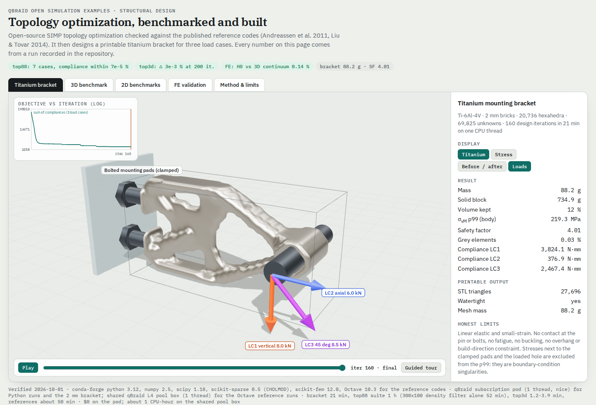

# Topology optimization: benchmarked, then built

Open-source SIMP topology optimization, verified against the published reference
codes and then used to design a printable titanium bracket for three load cases.
The viewer is `viewer.html`: a single self-contained page. It needs network access only
for the three.js CDN.



## What "top 10 %" means here, and the verdict

For design methods, the field measures itself against the published reference
implementations. The bar for this example:

| Bar | Source | Metric | Verdict |
|---|---|---|---|
| Reproduce **top88** (2D) | Andreassen, Clausen, Schevenels, Lazarov, Sigmund, *Struct Multidisc Optim* 43 (2011). MBB beam at the paper's three meshes, sensitivity and density filters; plus Sigmund's (2001) cantilever | Optimal compliance within 1 %, same layout | **Reached** (see table) |
| Reproduce **top3d** (3D) | Liu & Tovar, *Struct Multidisc Optim* 50 (2014), default cantilever 60 × 20 × 4 | Optimal compliance within 1 %, same layout | **Reached on compliance** (0.0032 % at matched iterations). Same topology; 4.6 % of the elements sit in a different place after iteration 56, see below |
| FE kernel correct | Timoshenko beam theory plus an independent P2 tetrahedral solution | Two discretisations agree on the 3D continuum answer | **Reached**: within 0.14 % |
| Industrial-flavour 3D design | Titanium mounting bracket, 3 load cases, printable STL | Crisp design (< 1 % grey), stress below yield with margin, watertight STL | **Reached** at 2 mm resolution: 88 g, 0.03 % grey, linear-elastic safety factor 4.0, watertight STL. See [bracket](#the-titanium-bracket) |

The papers print designs, not compliance values. So the numerical reference is the
authors' own code, downloaded at run time and run **unmodified** in Octave 10.3. The
only edits are removing the plotting and saving the final design
(`reference/make_headless.py`).

## Results

### 2D: top88 (Python port vs the published code)

RESULTS_TOP88

The iterates are identical to round-off for long stretches; `identical_until_iter` in
`results/benchmarks.json` gives the first iteration where they differ by more than 1e-6.
Late in a run, the optimality-criteria update can oscillate. There, round-off differences
between two sparse solvers (CHOLMOD and Octave's solver) are amplified, and each run can
stop at a slightly different iteration. The final compliances still agree to well inside
the 1 % bar.

### 3D: top3d

RESULTS_TOP3D

### FE validation: clamped cantilever, L/h = 10

RESULTS_VALIDATION

The 3D continuum answer sits 0.69 % below Timoshenko, because a fully clamped 3D root
restrains the cross-section, which beam theory ignores. The trilinear brick (the element
used by top3d and by the bracket) is stiff in bending. That is why the bracket keeps at
least 6 to 10 bricks across its members.

### The titanium bracket

RESULTS_BRACKET
How it was made, and what is still open:

- **The run stopped at its 160-iteration cap, not on a convergence rule.** After the final projection step (β = 16) the OC update oscillates at its move limit, while the summed compliance stays within ±0.03 % (1517.2 to 1517.8). The design is settled; the stop rule is not met.
- **Resolution: 2 mm, not the planned 1.5 mm.** The 1.5 mm run (64 × 32 × 24, 161k unknowns) waited 35 minutes for a slot on the shared pool box and was cancelled. On a dedicated `cpu-8v-32g` it is an estimated 1 to 2 hours. Finer bricks give thinner members and a smoother part; the layout should not change.
- **STL.** The density field is upsampled 2× (trilinear), contoured with marching cubes, and lightly Taubin-smoothed. The contour level (0.44) is chosen so the mesh carries exactly the optimized material volume (88.2 g), rather than using the nominal 0.5, which loses about 6 % on thin members.

## Reproduce

```bash
# environment (conda-forge), ~2.5 GB; put it on local disk
micromamba create -p ./env -c conda-forge python=3.12 numpy scipy scikit-sparse scikit-image scikit-fem trimesh matplotlib octave
export OCTAVE_HOME=$PWD/env            # conda-forge Octave 10.3 needs this

reference/fetch_reference.sh            # downloads top88.m / top3d.m and makes headless copies
(cd reference && octave-cli --no-gui run_reference.m cantilever)   # also: top3d, mbb, lk
python run_benchmarks.py all            # Python ports (single thread is fine)
python compare.py                       # results/benchmarks.json
python validate_fe.py                   # results/validation.json
BRACKET_H_MM=2.0 BRACKET_TAG=_2mm python bracket.py   # or 1.5 mm (default) on a bigger box
python export_viewer_data.py && python build_viewer.py # viewer.html
```

STAMP

## Honest limits

- **Physics.** Linear elastic, small strain, compliance objective. No contact at the
  pin or bolts, plasticity, fatigue, buckling or thermal loads.
- **Manufacturing.** No overhang, minimum-member-size or build-direction constraints. The
  STL is a starting geometry for an additive-manufacturing engineer, not a qualified part.
- **Stress.** Element-centroid von Mises stress on trilinear bricks. The p99 excludes the
  elements next to the clamped pads and the loaded hole, where the boundary conditions
  create singularities.
- **Against Abaqus/ATOM, Ansys and OptiStruct.** The optimization core is the same family
  (SIMP, filters, projection, multiple load cases, passive regions). What the commercial
  tools add is manufacturing and stress constraints, nonlinear and contact analysis,
  certified solvers and support. That gap is real; this example doesn't claim to close it.
