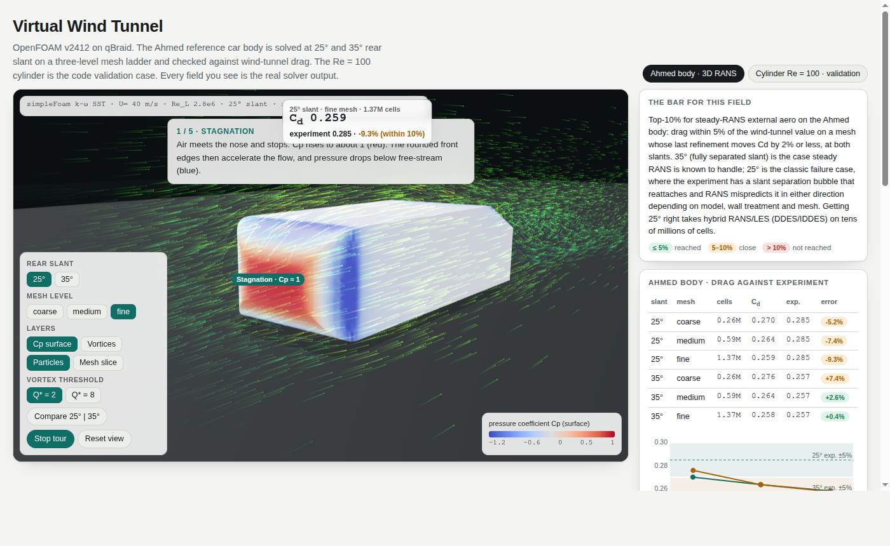
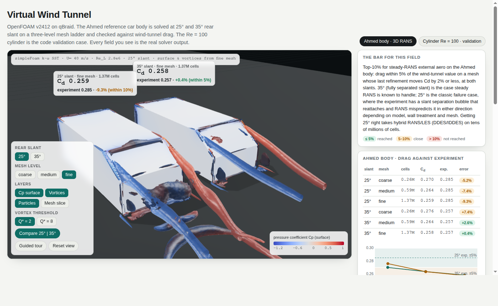
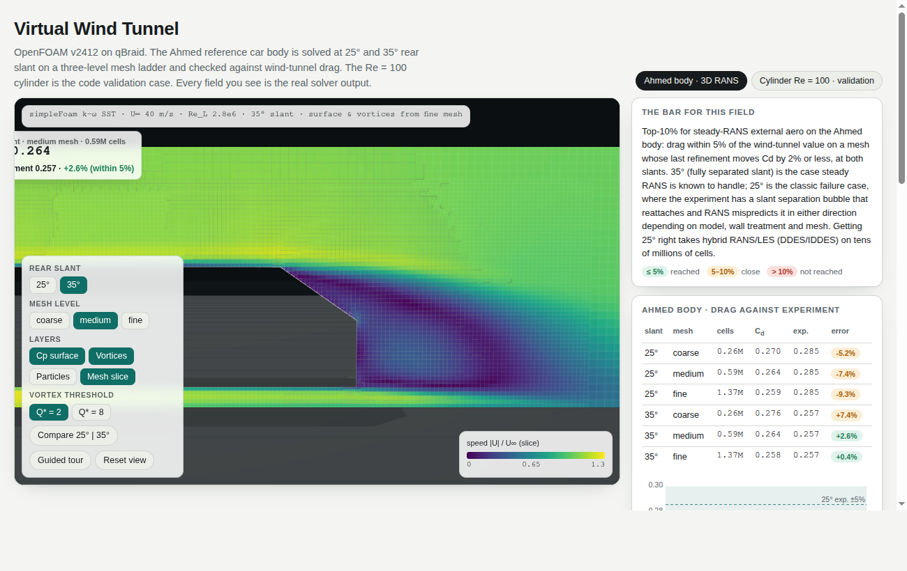
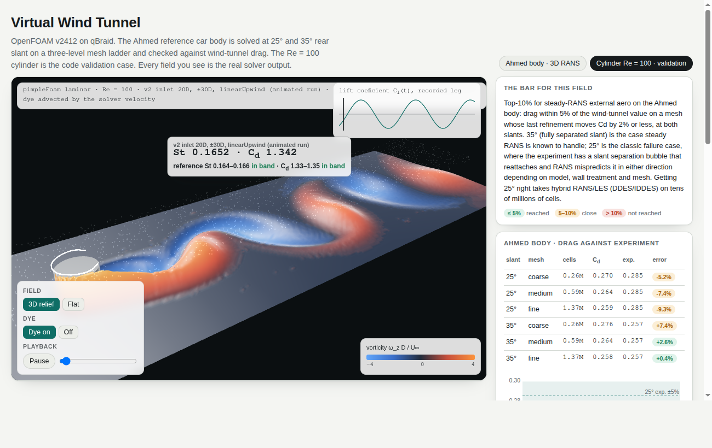

# Virtual wind tunnel

Aerodynamics on qBraid with open-source CFD. This example takes a reference car
body to drag, pressure and vortex structure on a three-level mesh ladder, and
checks the results against wind-tunnel measurements. A laminar cylinder serves
as the code-validation case. Everything is rendered as an interactive three.js
scene in the Agent Canvas.

**Stands in for:** Ansys Fluent and Siemens STAR-CCM+ for incompressible external aerodynamics.
**Stack:** OpenFOAM v2412 (GPL-3.0), gmsh 4.15, pyvista 0.49 (VTK 9.6) and MPICH 4.3, all from conda-forge.
**Quantum today:** nothing practical for CFD. See `docs/pathway.html` for the honest horizon view.

| Guided tour (stagnation) | C-pillar vortices, 25° vs 35° |
|---|---|
|  |  |
| **Mesh slice (real cell edges), cut-away body** | **Cylinder Re = 100, vortex street with dye** |
|  |  |

## The bar: what top-10% means here

The comparison is against published measurements and the known behaviour of
the method, not against a vendor's marketing numbers.

- **Code validation (cylinder, Re = 100).** Strouhal number and mean drag must
  fall inside the band agreed across the literature for an unconfined
  cylinder:
  - St 0.164–0.166, Cd 1.33–1.35.
  - Sources: Williamson 1996; Park, Kwon & Choi 1998 (St 0.165, Cd 1.33);
    Qu et al. 2013 (St 0.1648, Cd 1.326).
  - A good open-source setup lands inside the band. A careless one, with a
    short domain or a diffusive scheme, lands 2–4% high, which is where v1 was.
- **3D (Ahmed body, steady RANS k-ω SST).** Drag must be within 5% of the
  wind-tunnel value, on a mesh where the last refinement moves Cd by 2% or
  less, at both slants.
  - Reference drag: Ahmed, Ramm & Faltin 1984 (SAE 840300), Cd 0.285 at 25°
    and 0.257 at 35°.
  - 35° (fully separated slant) is the case steady RANS is known to handle.
  - 25° is the classic failure case. The experiment has a separation bubble
    on the slant that reattaches, and steady two-equation RANS mispredicts it
    in either direction depending on model, wall treatment and mesh.
  - Getting 25° right takes hybrid RANS/LES (DDES or IDDES) on tens of millions
    of cells. That is where workshop-grade entries sit, and it's out of reach of
    a $75 budget.

## Results (verified 2026-10-01)

### Cylinder, Re = 100: **reached**

| Run | Cells | St | Cd | Verdict |
|---|---|---|---|---|
| v1: inlet 10D, side walls ±30D, linearUpwind | 32.7k | 0.1685 | 1.381 | 1.5% / 2.3% above the band |
| **v2: inlet 20D, side walls ±30D, linearUpwind** | 35.2k | **0.1655** | **1.346** | inside both bands |
| v2: inlet 20D, ±30D, central differencing, Co 0.5 | 35.2k | 0.1652 | 1.341 | inside both bands |
| Reference | | 0.164–0.166 | 1.33–1.35 | |

- **What changed:** the inlet distance. At 10D upstream, the inlet boundary
  condition pins the velocity too close to the body's upstream influence.
- **Moving it to 20D closed the whole gap.** St dropped 1.8% and Cd 2.5%, both
  into the band. Switching from linearUpwind to central differencing moved the
  answer by less than 0.4%, so numerical diffusion was not the cause.
- **Averaging window:** St and Cd are averaged over 6 shedding cycles,
  t = 80–120.

### Ahmed body: **35° reached, 25° not reached** (see `results/ahmed_v2.json`)

AHMED_TABLE

- **35°: reached.** On the fine mesh Cd is within 0.4% of the experiment,
  inside the 5% band. The last refinement moved it by LADDER35.
- **25°: not reached.** Every level sits 5–10% below the experiment, Cd keeps
  falling as the mesh refines (about 2% per level), and the flow topology is
  wrong:
  - A probe 6 mm above the slant centreline finds positive streamwise velocity
    along the whole slant (0.50 → 0.10 U∞ from top edge to base). The RANS
    flow stays attached.
  - The measured flow (Lienhart & Becker 2003) separates at the slant's top
    edge and reattaches part-way down.
  - Missing that bubble lowers the slant suction and the drag. That is the
    textbook way steady RANS fails here.
  - Lift tells the same story. The attached 25° flow carries Cl = 0.31 (half
    model), while the fully separated 35° flow carries Cl = 0.10.
- **What it would take:** DDES or IDDES on 20–40M cells with prism layers
  (y+ ≈ 1) and averaging over about 20 convective times.
  - That is about 1–2 days on one `cpu-64v-256g`, roughly **$90–180 per case**
    at $3.84/h.
  - It's a natural "next" step if this example is meant to carry a top-10%
    claim at 25°.

### Compute used

COMPUTE

## The viewer

`viewer.html` is a single 4.6 MB file with every array inlined (gzip and
base64). Open it directly, or run `qbraid-canvas wind-tunnel/viewer.html`.
three.js 0.170 loads from jsDelivr; everything else is in the file.

- **Body:** the real Cp surface (48k triangles) on a physically based clearcoat
  material, mirrored from the half model.
- **Vortices:** Q-criterion isosurfaces at Q* = 2 and 8, coloured by streamwise
  vorticity. A dark-midpoint diverging map makes the counter-rotating C-pillar
  pair read at a glance.
- **Particles:** 6,500 particles advected live through the solver's own
  velocity field. The field is sampled on a 128 × 40 × 42 grid; particles are
  stepped with a midpoint scheme and drawn as speed-coloured streaks.
- **Mesh slice:** the symmetry plane rendered from the real cells (cell edges
  visible) for each mesh level. The near half of the body is cut away so the
  slice shows through.
- **25° | 35° comparison:** both bodies side by side, each with its own in-scene
  drag tag (Cd, experiment, error, verdict).
- **Guided tour:** five camera stops with captions and pins (stagnation,
  suction peaks, C-pillar vortices, the slant, the benchmark).
- **Cylinder tab:** the solver's vorticity as a lit 3D relief, dye advected by
  the solver's time-interpolated velocity, a lift trace with a playhead, and
  scrubbing.
- **URL presets for demos and screenshots:**
  - `#tour`, `#compare`, `#vortex`, `#slice`, `#front`, `#cyl`
  - optional parameters `&slant=35&level=medium&q=8&particles=0&theme=dark`
- **Themes and layout:** light and dark themes (the 3D stage stays dark in
  both, like a video viewport), and responsive down to phone width with a
  Controls toggle.

## Reproduce

```bash
export MAMBA_ROOT_PREFIX=/tmp/mamba
micromamba create -p /tmp/envs/cfd -f wind-tunnel/env/environment.yml        # ~1 min, 4.2 GB, keep it on /tmp
alias cfd='micromamba run -p /tmp/envs/cfd'

# 1. cylinder validation (inlet 20D, walls ±30D): ~17 min on 2 ranks
T1=120 cfd bash wind-tunnel/cylinder2d/run.sh fine /tmp/runs/cyl_x20_lu 2 30 20
SCHEME=linear MAXCO=0.5 T1=120 cfd bash wind-tunnel/cylinder2d/run.sh fine /tmp/runs/cyl_x20_lin 2 30 20
T1=100 cfd bash wind-tunnel/cylinder2d/run.sh fine /tmp/runs/cyl_x20_frames 2 30 20   # the run the viewer animates

# 2. Ahmed ladder: SLANT 25|35, LEVEL coarse|medium|fine (0.26M / 0.59M / 1.37M cells, half model)
for s in 25 35; do for l in coarse medium fine; do
  SLANT=$s LEVEL=$l cfd bash wind-tunnel/ahmed/run.sh /tmp/runs/a${s}_$l 2
done; done                                              # fine: ~40 min on 2 ranks; RESUME=1 continues a run

# 3. results and viewer
cfd python wind-tunnel/collect_v2.py /tmp/runs            # -> results/ahmed_v2.json, results/validation_v2.json
for s in 25 35; do cfd python wind-tunnel/ahmed/extract_v2.py /tmp/runs/a${s}_fine /tmp/payload/a${s}_surface.npz --surface
  for l in coarse medium fine; do cfd python wind-tunnel/ahmed/extract_v2.py /tmp/runs/a${s}_$l /tmp/payload/a${s}_${l}_slice.npz --slice-png /tmp/payload/a${s}_$l.png; done; done
(cd /tmp/runs/cyl_x20_frames && cfd postProcess -func vorticity -time '100:')
cfd python wind-tunnel/cylinder2d/frames_v2.py /tmp/runs/cyl_x20_frames /tmp/payload/cylinder_frames.npz
python wind-tunnel/build_viewer.py /tmp/payload
qbraid-canvas wind-tunnel/viewer.html --title "Virtual wind tunnel"
```

### Traps, all handled in the scripts

- **Parallel runs die in `conda-forge::openfoam=2412`** with "The dummy Pstream
  library cannot be used in parallel mode". The binaries carry an RPATH to the
  dummy library. Fix:
  `mpirun -genv LD_PRELOAD $CONDA_PREFIX/lib/mpich-3.3/libPstream.so ...`
- **No `etc/caseDicts`**, so snappyHexMesh can't include `meshQualityDict`. The
  quality controls are inlined in the case.
- **A restarted leg silently starts from t = 0** if the first leg didn't write a
  time directory at its end. `startFrom latestTime` finds nothing newer than 0,
  and nothing warns you. `cylinder2d/run.sh` sets `writeInterval` to the leg's
  end time. This bug cost one pair of v2 runs. The force history of their
  first leg (t = 0–120) was complete and is what the table quotes.
- **`nproc` lies on qBraid instances.** The gpu-l4 box reports 48 CPUs, but its
  cgroup quota is 5.1 (`/sys/fs/cgroup/cpu/cpu.cfs_quota_us`). Size MPI runs from
  the quota.
- **Headless screenshots on the pod** need Playwright's Chromium, the conda-forge
  GUI libraries, and SwiftShader for WebGL:
  ```
  LD_LIBRARY_PATH=/tmp/ose-envs/chromelibs/lib chrome --headless=new --no-sandbox --use-angle=swiftshader --enable-unsafe-swiftshader --virtual-time-budget=15000 --screenshot=...
  ```
  Headless Chrome enforces a minimum window width of about 500 px, so check
  phone layouts inside a 390 px iframe.

## Limits

- **Turbulence model and walls:** steady RANS (k-ω SST) with wall functions
  and no prism layers. The 25° slant flow stays attached where the experiment
  separates and reattaches.
- **Model and conditions:**
  - The body has no stilts, and the floor is a no-slip stationary wall.
  - The reference drag was measured at 60 m/s (Re 4.3e6); these runs are at
    40 m/s (Re 2.8e6), the Lienhart & Becker condition. Ahmed-body drag is
    only weakly Re-dependent at this scale, but the difference is not zero.
- **Mesh:** the ladder tops out at 1.37M cells (half model) on the lean budget.
  Workshop-grade entries use 10–50M cells.
- **Particles and dye:** they animate the real solver fields, but the in-browser
  advection is a visual aid, not a solver.

## Next: needs more compute

| Step | Machine | Estimate |
|---|---|---|
| 25° with IDDES, 20–40M cells, prism layers, ~20 convective times averaged | `cpu-64v-256g`, $3.84/h | 1–2 days, **$90–180** |
| XLB (GPU lattice Boltzmann) transient run of the same body, to compare the unsteady wake. Not run: the shared pool's single L4 and 50 GB disk were saturated by ten streams | `gpu-l4` or `gpu-h100-sxm` | about 1 h, **$0.50–5.40** |
| 20-case slant × speed sweep with a PhysicsNeMo surrogate in the browser | `cpu-64v-256g` plus `gpu-h100-sxm` | about **$175** |
