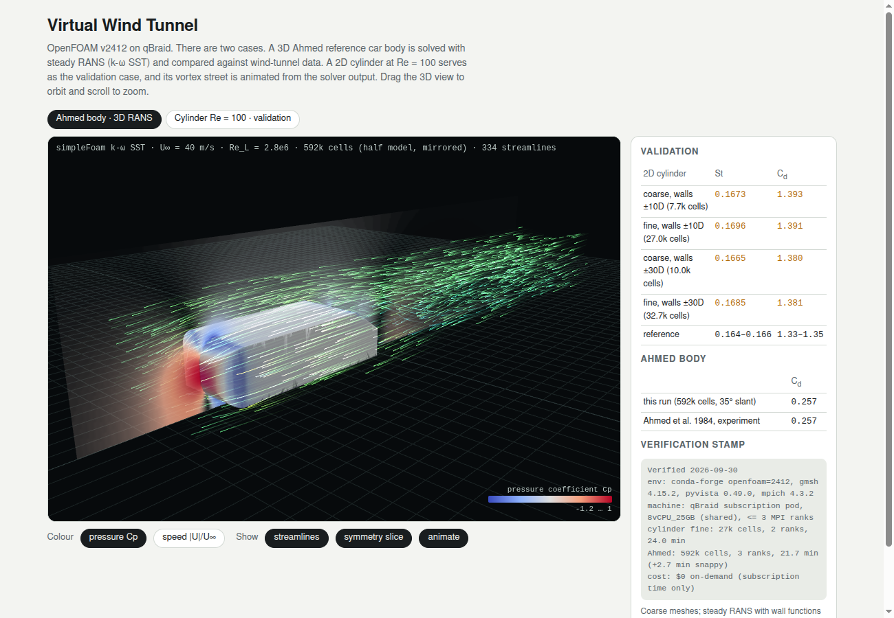

# Virtual wind tunnel

Aerodynamics on qBraid with open-source CFD. The workflow takes a car-like body
to drag, pressure and flow structure. It checks the numbers against published
experiments and renders the result as an interactive three.js scene in the
Agent Canvas.

**Stands in for:** Ansys Fluent and Siemens STAR-CCM+ for incompressible external aerodynamics.
**Stack:** OpenFOAM v2412 (GPL-3.0), gmsh 4.15, pyvista 0.49 (VTK 9.6), MPICH 4.3, all from conda-forge.
**Quantum today:** nothing practical for CFD. See `docs/pathway.html` for the honest horizon view.



## What is here

| Path | What it does |
|---|---|
| `cylinder2d/` | Validation case: laminar flow past a cylinder at Re = 100, gmsh mesh (coarse and fine), transient `pimpleFoam` |
| `ahmed/` | 3D showcase: Ahmed reference body (35° slant), `snappyHexMesh` + steady `simpleFoam` k-ω SST |
| `build_viewer.py`, `viewer_template.html` | Inline the results into a single self-contained `viewer.html` |
| `viewer.html` | The viewer (open it directly, or `qbraid-canvas wind-tunnel/viewer.html`) |
| `results/*.json` | Verified numbers and the verification stamp |
| `env/environment.yml` | Pinned conda-forge environment |

## Verified results

Verified 2026-09-30 on the qBraid subscription pod (`8vCPU_25GB`, shared with
other workloads, at most 3 MPI ranks). The cost was $0 in subscription time,
with no on-demand compute.

### Validation: cylinder, Re = 100 (`results/validation.json`)

| Mesh and domain | Cells | St | Cd (cycle mean) | Wall time |
|---|---|---|---|---|
| coarse, side walls ±10D (5% blockage) | 7.7k | 0.1673 | 1.393 | 6.4 min, serial |
| fine, side walls ±10D | 27.0k | 0.1696 | 1.391 | 24.0 min, 2 ranks |
| coarse, side walls ±30D (1.7% blockage) | 10.0k | 0.1665 | 1.380 | 6.0 min, 2 ranks |
| **fine, side walls ±30D** | 32.7k | **0.1685** | **1.381** | 20.1 min, 3 ranks |
| Reference (unconfined, Re = 100 literature) | | 0.164–0.166 | 1.33–1.35 | |

How to read this:
- Cd is mesh-converged (the coarse and fine meshes agree within 0.2%). St moved
  by 1.3% between meshes, so the fine mesh is the one to quote.
- Widening the domain from ±10D to ±30D lowered both St and Cd by about 1%,
  so blockage explains part of the offset.
- The best case is still **1.5–2.7% high on St** and **2.3–3.8% high on Cd**.
  Likely remaining causes are the short 10D inlet distance and the second-order
  upwind-biased convection scheme. This passes a 5% acceptance band but is not
  a perfect match. An inlet at 20D is the next check.

### 3D: Ahmed body, 35° slant (`results/ahmed.json`)

| | Cd |
|---|---|
| This run: 592k cells, half model, k-ω SST, 800 iterations | **0.2574** (±0.0001 over the last 200 iterations) |
| Experiment, Ahmed, Ramm & Faltin 1984 (SAE 840300), Re = 4.3e6 | 0.257 |

The 0.2% agreement is **partly fortuitous**. Steady RANS with wall functions
on a 0.6M-cell mesh without prism layers normally lands within 5 to 15% of this
experiment. The model also omits the stilts and uses a moving ground, where the
experiment had a stationary floor. Treat it as a sanity anchor, not as evidence
of accuracy. The honest claim is "right magnitude, right flow topology."

Wall time: snappyHexMesh 2.7 min (serial), potentialFoam + 800 simpleFoam
iterations 21.7 min (3 ranks), extraction 6 s.

## Reproduce

```bash
export MAMBA_ROOT_PREFIX=/tmp/mamba
micromamba create -p /tmp/envs/cfd -f wind-tunnel/env/environment.yml      # ~30 s, 3.4 GB on the overlay
alias cfd='micromamba run -p /tmp/envs/cfd'

# 1. validation (coarse serial ~6.5 min; fine on 2 ranks ~24 min; blockage checks ~6 and ~20 min)
cfd wind-tunnel/cylinder2d/run.sh coarse /tmp/runs/cyl_coarse 1
cfd wind-tunnel/cylinder2d/run.sh fine   /tmp/runs/cyl_fine   2
cfd wind-tunnel/cylinder2d/run.sh coarse /tmp/runs/cyl_coarse_w30 2 30     # side walls at +/-30 D
cfd wind-tunnel/cylinder2d/run.sh fine   /tmp/runs/cyl_fine_w30   3 30
cfd python wind-tunnel/cylinder2d/collect.py /tmp/runs wind-tunnel/results/validation.json

# 2. Ahmed body (~25 min on 3 ranks)
cfd wind-tunnel/ahmed/run.sh /tmp/runs/ahmed 3
cfd python wind-tunnel/ahmed/forces.py /tmp/runs/ahmed 200

# 3. viewer payload and viewer
(cd /tmp/runs/cyl_fine && cfd postProcess -func vorticity -time '185:')
cfd python wind-tunnel/cylinder2d/frames.py /tmp/runs/cyl_fine wind-tunnel/results/cylinder_frames.npz
cfd python wind-tunnel/ahmed/extract.py /tmp/runs/ahmed wind-tunnel/results/ahmed_viewer.npz
cfd python wind-tunnel/build_viewer.py
qbraid-canvas wind-tunnel/viewer.html --title "Virtual wind tunnel"
```

### Traps in `conda-forge::openfoam=2412`, all handled in the scripts

- **Parallel runs die** with "The dummy Pstream library cannot be used in
  parallel mode". The binaries carry an RPATH to `lib/dummy/libPstream.so`, which
  `LD_LIBRARY_PATH` cannot override. The fix is
  `mpirun -genv LD_PRELOAD $CONDA_PREFIX/lib/mpich-3.3/libPstream.so`.
- **No `etc/caseDicts`**, so `#includeEtc "caseDicts/mesh/generation/meshQualityDict"`
  fails in snappyHexMesh. The quality controls are inlined instead.
- The **gmsh Python API** is a separate package, `python-gmsh`.

## Limits

- Both cases are coarse by industrial standards. The 3D case has no prism
  layers and uses wall functions (y+ well above 30).
- Steady RANS cannot resolve the unsteady wake. For the 25° slant (the harder
  case, where the flow reattaches), RANS is known to mispredict Cd. Use hybrid
  RANS/LES on a larger machine for that case.
- The cylinder frames are an animation of the real solution. The in-browser
  flow demo in `docs/pathway.html` is a separate toy model.

## Next: needs an instance

The account was at its instance limit during this build, so these were not run:

| Step | Machine | Estimate |
|---|---|---|
| 20-case sweep (speed × slant angle 20–40°), one case per instance, 2–3M cells with prism layers | `cpu-64v-256g` at $3.84/h, 4 at a time | 20 × ~2 h = 40 instance-hours, about **$154** |
| XLB (GPU lattice Boltzmann) transient run of the same body, to compare the unsteady wake | `gpu-h100-sxm` at $5.37/h | about 1 h, about **$5.40** |
| PhysicsNeMo surrogate trained on the sweep, exported to ONNX and run in the browser (a Cd and Cp slider explorer) | `gpu-h100-sxm` | about 4 h, about **$21.50** |

Set `--auto-stop` on each instance, copy results back to the subscription pod
before terminating, and report the measured cost next to the numbers.
